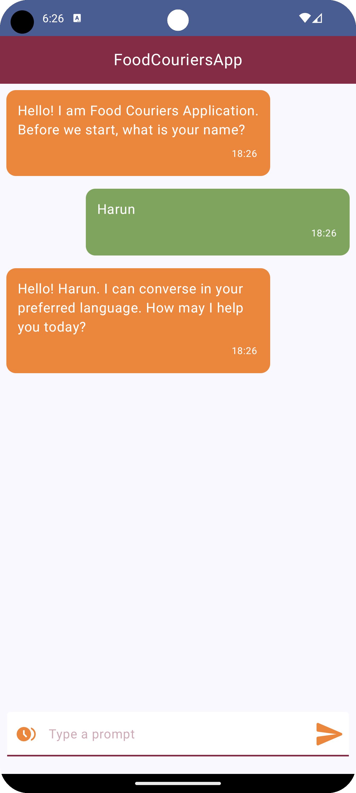
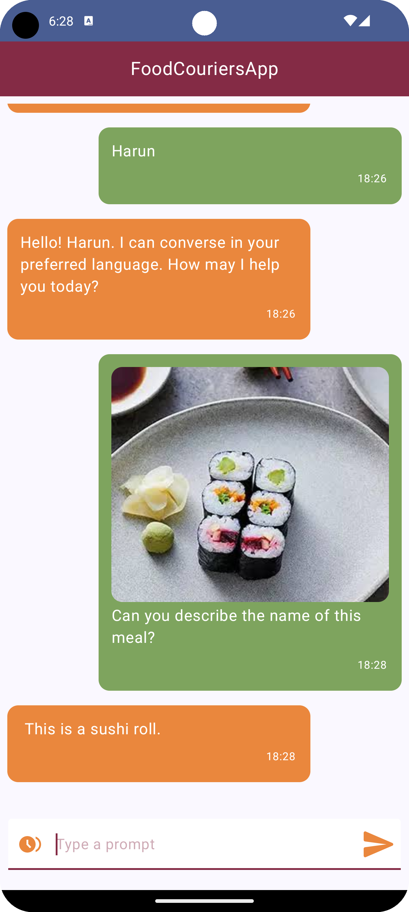
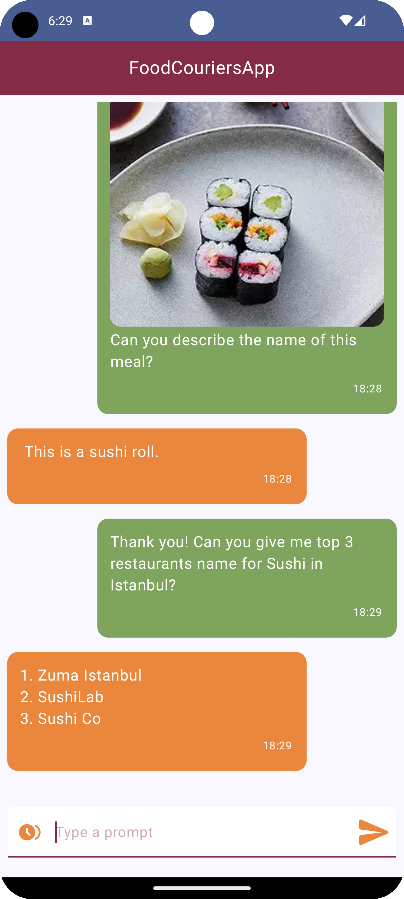
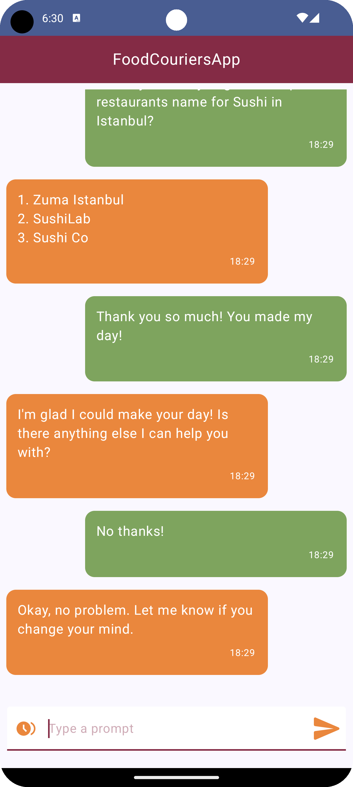

# FoodCouriersApp

## Genel Bakış
FoodCouriersApp, kullanıcılara Google AI ile sohbet imkanı sunan bir AI chat uygulamasıdır. Bu uygulama sayesinde kullanıcılar, görsel ve metin tabanlı isteklerini gönderip yanıt alabilirler. Uygulama, hem görselleri analiz edebilme hem de metin tabanlı talepleri işleme yeteneğine sahiptir.

## Özellikler
- Google AI Entegrasyonu: Kullanıcılar, Google AI ile sohbet edebilir.
- Görsel İşleme: Kullanıcıların yüklediği görselleri analiz eder ve yanıtlar sunar.
- Metin Tabanlı İşlemler: Metin tabanlı istekleri alır ve yanıtlar.

## Kurulum ve Kullanım İçin Gereksinimler
- Google AI API Key:
  * Google AI Studio API key' iniz bulunuyorsa:
    - API key' inizi model > data > ChatData da bulunan API_KEY in içerisindeki "YOUR_API_KEY" stringi ile değiştirerek uygulamayı kullanın.
    
  * Eğer Google AI için API anahtarınız bulunmuyorsa:
    - [Google AI Studio - Get API key](https://aistudio.google.com/app/apikey) bağlantısından kendinize ait bir API anahtarı oluşturun.
    - model > data > ChatData da bulunan API_KEY in içerisindeki "YOUR_API_KEY" stringini oluşturduğunuz API anahtarı ile değiştirerek uygulamayı kullanın.

## Ekran Görüntüleri
&nbsp;&nbsp;
&nbsp;&nbsp;
&nbsp;&nbsp;

